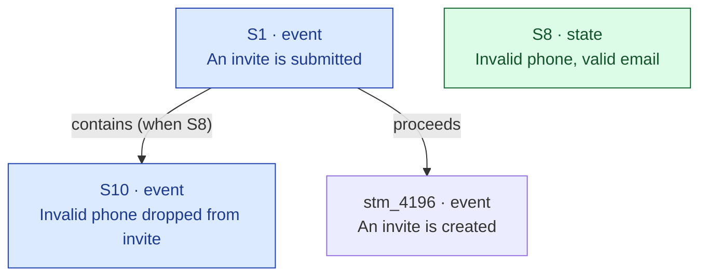

# Mycelium Draft Authoring

Research a product domain, plan the statements and links needed to document it in the mycelium substrate, and write a structured draft markdown file — fronted by a topology diagram — for human review.

**You may not mutate the substrate.** The draft file is your only output.

---

## Permitted tools

**Substrate (read-only):**
`search_statements`, `grep_statements`, `get_statements`, `discover_facts`, `list_entities`, `get_entity`, `list_link_types`, `list_entity_link_types`, `list_statements`

**Files / shell (read-only):**
`Read`, `Glob`, `Grep`, `Bash` — read-only operations only (no writes, no destructive commands)

**File write — one location only:**
`Write` to `context/mycelium-drafts/<slug>.md`

**Forbidden — never call these:**
All substrate write/mutation tools: `upsert_statement`, `upsert_statements`, `upsert_entity`, `upsert_name`, `rename_name`, `add_links`, `remove_links`, `add_entity_links`, `remove_entity_links`, `delete_statement`, `delete_entity`, `delete_name`, `merge_statements`, `merge_entities`, `move_name`, `replace_text`, `patch_statement`, `add_mentions`, `remove_mentions`

---

## Content rules come from `mycelium-authoring`

**Load and follow the `mycelium-authoring` skill in full** for every content decision — kind selection, depth/decomposition, atomicity, link method, structural patterns, and topology. This skill adds only the research protocol, the no-write constraint, the output format, and the topology diagram. It does **not** restate authoring rules, and where this file ever appears to differ, authoring wins.

Three things follow from the authoring rewrite and govern everything below:

- **Depth policy lives in authoring §1**, not here: every distinct product action is its own statement, wired in execution order — *including* linear sequences — and every computation decomposes into stages, wired in derivation order (authoring §1e). This skill's research protocol is the *how* (reading code to find those actions and stages); it does not set the depth bar.
- **Link and kind vocabulary lives in the live tools**, not in any skill. Always call `list_link_types()` / `list_entity_link_types()` this session and treat what they return as the full menu. Any type names appearing in either skill are illustrations, not the available set. (This depends on those tool descriptions being complete — if a returned type has an empty description, flag it; you can't model a link whose meaning you can't read.)
- **Phrasing is validated at apply time, not draft time** — see the checklist note. This skill never calls `upsert_statement`, so it never sees a phrasing rejection. Aim for clean per-kind shapes (authoring §5) but treat the apply step as the real gate.

---

## Research protocol

Work through these steps before writing a single line of the draft.

### 0. Boundary survey — always first

Before reading any code, walk the substrate to understand what already exists around the domain and what the draft must connect to. This step shapes everything that follows: it reveals the existing entry points and exits the draft must anchor to, prevents re-proposing what is already modelled, and surfaces the 1–2 layers of upstream/downstream context that belong as dashed existing nodes in the topology.

**Run in this order:**

1. `search_statements(query=<domain>, depth=2, direction="both")` — semantic 2-hop neighbourhood scan. Collect every hit and its neighbours.
2. `grep_statements(query=<core-term>)` — literal match to catch anything the semantic search missed.
3. `get_statements(ids=[...])` — hydrate the top 10–15 most relevant hits. Read their `links` and `incoming_links` to map the live graph edges into and out of the domain.
4. From the hydrated results, identify:
   - **Entry statements** — existing statements whose outgoing edges point *into* the domain (these are Layer 1 upstream; they appear as dashed nodes in the topology).
   - **Exit statements** — existing statements the domain's events trigger or proceed to (Layer 1 downstream; dashed nodes).
   - **Already-modelled interior** — existing statements *inside* the domain that the draft must not duplicate but must connect to.
   - **Orphaned adjacent statements** — existing statements with no outgoing links that are adjacent to the domain; the draft may be the thing that wires them.
5. Optional Layer 2: repeat `get_statements` one hop further on the entry/exit nodes to understand what sits two layers out. Keep these as context only — they clarify scope and show the reviewer what the draft is *not* touching.

**What this produces:**

A mental map with three zones: (a) existing context the draft inherits from upstream, (b) the interior the draft will propose, (c) existing targets downstream the draft should trigger into. This map directly drives the topology diagram's dashed existing nodes and is the basis for the "Incoming links from existing" and "Links between existing" tables in the draft.

**The zone boundary is the draft's scope.** Anything in zone (a) or (c) is shown as an existing (dashed) node but not re-proposed. The draft's new statements live in zone (b). If zone (b) is larger than expected, split into multiple draft files rather than widening scope.

---

### 1. Read the codebase first
The codebase at `<path-to-product-codebase>/` is authoritative. The substrate may contain records from incorrect assumptions — always verify behavioral claims against code before proposing them.

For the domain you're documenting, find and read:
- Relevant models, schemas, config structs
- Service methods and their call chains
- Event triggers, branching conditions
- Computation/scoring code — formulas, weightings, thresholds, the order values are derived in
- Any external API contracts (webhooks in/out, third-party API calls)

Note file paths and line numbers for any non-obvious claims — these go in the **Uncertainties** section if you can't confirm them directly.

### 2. Survey the substrate
- `grep_statements(query=<domain-name>)` — literal match for the core term
- `list_entities(prefix=<name>)` — find existing entities to mention
- `search_statements(query=<main-concept>, depth=1)` — semantic neighborhood of the domain
- `list_link_types()` **and** `list_entity_link_types()` — read the full, current link vocabulary and each type's meaning/direction before proposing any link. This returned set is the menu; do not work from remembered type names.

### 3. Discover before drafting
Run `discover_facts(texts=[...])` on every statement text you intend to propose before adding it to the draft. A score measures *similarity*, not *sameness of claim* — read the match before deciding. Interpret results:
- `exists` (≥ 0.85): a near-identical statement is in the substrate. `get_statements` it and check what the claim actually is. **Same claim in different words** → don't draft it; reference the existing id in links. **A parallel that differs only by one value** (Low/Medium/High level, above/below a threshold, increase/decrease) → it is legitimately distinct; draft it anyway and note in the discover results why it stands alone. High similarity between mirror statements is expected (authoring §10) — it is not a signal to collapse them.
- `near` (0.6–0.85): related claim exists. `get_statements(ids=[...])` on the matches to understand the overlap. Either reuse the existing statement, propose a link from your new statement to it, or — if it's a genuine parallel or a distinct claim — keep it and explain in **Uncertainties** or the discover results why.
- `new`: safe to add.

For short property labels (single words or two-word phrases), `discover_facts` scores are unreliable — cross-check with `grep_statements` instead.

### 3a. Reading code for the right depth

Depth policy is authoring §1: every distinct product action is its own statement, wired in order, linear sequences included. This section is the *how* — reading the code to find those actions and verify their shape. Go deep on every product action; the only things that stay shallow are invisible plumbing (authoring §1b: logging, encryption, retry scheduling, ORM/DB mechanics).

**Computed values decompose too (authoring §1e).** When the code computes a value — a score, a weighting, a percentage, a threshold result — read the formula and break it into stages: each intermediate value is its own `state`/`property` `valued-by` its own rule, and the master rule `composes` the stages. Do **not** collapse a multi-stage computation into one *"X is computed"* capability with the config knobs hanging directly off it — that is the opaque hub this skill exists to expose. Trace the derivation order in the code (which value feeds which) the same way you trace execution order for a flow; the worked shape is `references/rule-kind.md`.

**Verify these from the code — never assume:**

- **Properties — `requires` vs `accepts`.** Check whether a field can be absent or `None`: `.get("field")` vs `["field"]`, type annotations like `str | None`, and whether there is a distinct handling path when the value is absent. A field that is "always read" is not "always required" — the code may read it and proceed when it's `None`. Asserting `requires` when the code says `accepts` is wrong.
- **Condition states — split whenever the code branches on the same check.** If a dedup check, validation, or error handler has two or more code paths with different outcomes, each path is a separate state. Read the full branch logic: `if/else`, early returns, fallbacks producing different results. Do not collapse them into one vague state.
- **Events with idempotency or error branches.** If a method can return early without completing its main work (`INTEGRATION_ALREADY_SET_UP`, `ORDER_NOT_EXISTS`, retry exhaustion), the sub-steps that only fire on the non-early path are conditional. **Check the current `when` grammar via `list_link_types()` before assuming a condition is inexpressible** — the grammar has gained operators. If it genuinely can't be expressed, note the limitation in Uncertainties rather than inventing an unexpressible condition.
- **Shared events serving multiple flows.** Before linking an existing event as a parent for new statements, `get_statements` on it and inspect its current outgoing links. A `proceeds`/`triggers` edge already going somewhere may conflict with the new path. Two outgoing edges to different targets are valid only as genuinely parallel branches — confirm before proposing.
- **Computation stages — split whenever the code derives an intermediate.** If a scoring method computes a sub-total, applies a weight, maps a value to a level, or subtracts a penalty before producing the final value, each is a stage rule the master rule `composes`. A config field almost always parameterises *one* of these stages — attach it there, not to the capability.

**Stay shallow only here:**

- **Internal platform mechanics** — Celery retry scheduling, Fernet encryption, OAuth token caching, DB write patterns. Swappable without changing product behaviour; not statements.
- **Standard infrastructure side-effects** — logging, cache invalidation, metric emission. Skip unless they have a product-visible consequence (a log that fires a customer-visible alert is product-visible; a debug log is not).

### 4. Sketch the topology — spine first
Before writing the draft, find the **spine**: the central walkable chain of the domain. For an action domain that's the lifecycle/flow path (`proceeds`/`contains`/`triggers`); for a computation/config domain it's the derivation chain (capability →`governed-by`→ master rule →`composes`→ stages →`cases`→ branches, authoring §1e). Draw that chain end to end *first*.

Then hang the periphery — config knobs, condition states, leaf rules — off the **specific spine node each one governs**, not off the entry capability. If a knob has no spine node to attach to, the spine is under-decomposed: decompose it before drafting, don't park the knob on a hub.

This ordering is what prevents the star. Mapping shared targets, branches, sub-steps and properties still matters — but do it as elaboration of the spine, not as a flat inventory of facts that later need links retrofitted. This is the raw material for the topology diagram.

---

## Draft file format

Write to `context/mycelium-drafts/<slug>.md`. Use kebab-case based on the domain: `mcp-connection-setup.md`, `oidc-login-flow.md`.

Use this exact structure:

```
---
topic: [human-readable topic name]
status: draft
date: YYYY-MM-DD
codebase_ref: [key file paths read, comma-separated]
---

# Draft: [Topic]

## Context
[1–3 sentences: what this draft covers, why it's being added now, what gap it fills]

## Topology
[A mermaid flowchart of every proposed statement and link — see "Topology diagram" below. This is the reviewer's first read: the shape and granularity at a glance, before any table.]

## Uncertainties
[Every claim that could not be fully verified from code. Use ⚠️ prefix. If none: `None.`]

---

## New entities

| Name | Description | Aliases |
|------|-------------|---------|

[Omit section if no new entities.]

---

## New statements

| Ref | Kind | Text | Mentions |
|-----|------|------|----------|

Ref values are short labels (S1, S2, …) used for cross-referencing within this draft.
Mentions lists the entity names whose context the statement belongs to.

### Outgoing links from new statements

Edges FROM a new statement TO another statement (new or existing).

| From | Link type | To |
|------|-----------|-----|
| S3 | requires | S1 |
| S3 | requires | stm_abc123 · "An invite is created" |

[Omit section if no outgoing links from new statements.]

### Incoming links to new statements (from existing)

Edges FROM an existing statement TO a new statement.

| From ID | From text (truncated to ~60 chars) | Link type | To (ref) |
|---------|------------------------------------|-----------|----------|
| stm_cc52… | "An OIDC callback state is verified…" | requires | S4 |

[Omit section if none.]

---

## Links between existing statements

Edges to add where both endpoints are already in the substrate.

| From ID | From text (truncated) | Link type | To ID | To text (truncated) |
|---------|-----------------------|-----------|-------|----------------------|

[Omit section if none.]

---

## Entity links

Edges anchored on an entity, not between two statements — the statement-link tables above can't hold these (their endpoints are `Sn`/`stm_`). Two kinds, two tools.

### Entity → statement (`add_links`, `from_id=ent_…`)

Entity-level schema: which `property` records an entity `requires` / `accepts`, etc. (Properties are still anchored to the entity by `mentions` in the New statements table; these edges are the recommended schema-discovery layer on top — authoring §4c.)

| From entity | Link type | To (ref / id) |
|-------------|-----------|---------------|
| User Invite | requires | S1 · "Email" |
| User Invite | accepts | S4 · "Default role" |

[Omit section if none.]

### Entity ↔ entity (`add_entity_links`)

Structural relationships between entities (composition, specialisation, …). Vocabulary from `list_entity_link_types()` — separate from the statement-link vocabulary.

| From entity | Link type | To entity |
|-------------|-----------|-----------|

[Omit section if none.]

---

## Text updates

Statement texts to replace (e.g. after a rename propagation).

| Statement ID | New text |
|-------------|---------|

[Omit section if none.]

---

## Discover results

Summary of `discover_facts` findings — shows the reviewer what was checked and what already exists.

| Proposed text | Status | Action taken |
|--------------|--------|--------------|
| "Partner client ID" | new | Added as S1 |
| "An invite is created" | exists (stm_4196…) | Referenced as existing — not duplicated |
| "Partner client secret" | new | Added as S2 |
```

---

## Topology diagram

The diagram is the reviewer's fastest path to understanding *what* you're proposing and *at what grain*. Build it **last**, from the settled tables, so it matches them exactly — it is the same topology in visual form, not a separate claim.

**The diagram does not replace the tables, and they are not redundant.** The tables are the apply source of truth — exact statement text, mentions, full `when` trees, entity descriptions, discover provenance. The diagram is a deliberately *lossy* overview (short/paraphrased labels, no mentions, no provenance) optimised for a human's eyes. Two forms of the same topology, for two readers: the reviewer and the applier. Keep both in sync (checklist below).

Conventions:

- **One node per statement.** Label `<ref> · <kind><br/>short text` — draft ref (`S1`) for new statements, the real id (`stm_4196`) for existing ones. Keep the text short; strip any `"` and avoid `()` `[]` `{}` inside the label (they break mermaid) — paraphrase if needed, the full text is in the table.
- **Colour by kind; dash existing nodes.** Existing statements are reused, not added — dashing them shows the reviewer at a glance how much is new vs. anchored to what's already there. Apply the `classDef`s below verbatim. New nodes use inline `:::kind`; existing nodes use `class <id> <kind>,existing;`.
- **One edge per proposed link, labelled with the link type.** Append any `when` condition in parentheses, and wrap the whole edge label in quotes so mermaid parses the parens: `-->|"triggers (when S8)"|`. Draw *every* proposed edge, including links between two existing statements (both nodes dashed). Existing edges already in the substrate that you are not changing are normally omitted; include one faintly only if it's needed to make a new attachment legible.
- **Entities are not nodes** by default (they are mention-anchors, shown in the table). Show an entity only when you propose an entity↔statement or entity↔entity link, styled `:::entity`.
- **No grouping.** Do not wrap nodes in `subgraph`s or phase boxes. The substrate has no global structure — any statement is a valid entry point, traversal is local — so visual phases would draw a structure that isn't stored and mislead the reviewer about what gets written. Layout direction (`TD`/`LR`) is fine; invented grouping is not.

Template (fill from the tables — this is illustrative, not a fixed shape):



A reviewer scanning this should immediately see: how many new statements, how many reuse existing ones, the kinds in play (colour), the proposed link semantics (edge labels), and **whether there is a walkable spine or a star** — a central chain they can trace, versus a hub with spokes. That is both the *intention* and the *level of detail*, before reading a single table row.

---

## Before writing the file

Run through this checklist mentally. If any item fails, fix the draft content first.

**First, read the proposed graph back off the Topology diagram** and fix these structural smells — they are errors that neither the apply-time validator nor the code-review agents below will catch:

- **Orphans** — a statement with no edge in or out (authoring §8). Wire it into its flow or drop it. Exception: a condition-state used only as a `when` leaf is correctly link-free.
- **Stars / opaque hubs** — ≈3+ statements converging on one node by the same link type, especially `configures` or `governed-by`, with nothing beneath that node. The hub is hiding an undecomposed mechanism (authoring §1e). Build the trunk — the master rule or flow chain the hub stands for — and re-point the spokes at the specific stage each one governs.
- **Untraversable** — pick the entry point and try to walk to a terminal or a leaf rule. If every path dead-ends after one hop, there is no spine (authoring §1d). A connected-but-flat graph passes the orphan check and still fails the reason this skill exists.
- **Reversed edges** — apply the flip test (authoring §6): every `contains` / `triggers` / `requires` / `establishes` points from the bigger / earlier / wrapping claim to the smaller / later / dependent one. If a label reads naturally as *"target [type] this source,"* it's backwards.
- **Dangling `when` leaves** — every condition named in a `when` resolves to a state that is drafted here or confirmed-existing by id. A `when` pointing at nothing is a silent gap.

Then run the checklist:

0. **Flow contamination check.** For every proposed link between two statements, ask: can both endpoints be reached from the same entry point in the same execution path? If statement A is in the magic-link flow and statement B is in the service-account token flow, a link between them is contamination unless they share a genuine common sub-step (confirmed in code). Flag any link whose endpoints live in mutually exclusive code branches. A contaminated link is worse than a missing link — it misstates causal reality.

0a. **Capability-hub gate (blocking).** No `configures` or `governed-by` edge may terminate on a `capability` node — see authoring §6 for the rule and its two honest exits (name the stage it targets, or scope the mechanism out explicitly). This fails the draft; it is the hard enforcement of the "Stars / opaque hubs" smell above. Walk every `configures`/`governed-by` edge in the diagram and confirm each lands on a rule/stage, not a *"X can be …"* hub.

1. **Each statement text follows its kind's phrasing routing** (authoring §5). Note: this skill never calls `upsert_statement`, so phrasing is **not** validated at draft time — the apply step is the gate. Aim for clean shapes; where you deliberately left text compound (e.g. a get-or-create), flag it so the applier knows to pass `allow_phrasing_violations`. Don't block the draft on borderline wording.
2. **Connected and walkable, not just orphan-free.** Every new statement has a link (incoming or outgoing) — condition-state `when`-leaf exceptions flagged explicitly — *and* the draft has a spine: the central object walks as a chain through real intermediates, not a flat star of spokes on a hub (authoring §1d, §1e; structural smells above).
3. **All `stm_...` IDs are real IDs** confirmed via `get_statements` — never guessed or invented.
4. **`discover_facts` has been run** on every statement text. All `exists` and `near` hits are addressed in the discover results table.
5. **Every entity in the Mentions column exists** in the substrate (confirmed via `list_entities` or `get_entity`). New entities appear in the New entities section first.
6. **Link types are from `list_link_types()` / `list_entity_link_types()`** fetched this session — no invented types; the live set is the menu, not any subset named in the skills.
7. **The Topology diagram matches the tables exactly** — every statement and every proposed link appears, nothing extra; node kinds and new/existing styling agree with the New statements table and the ID columns.
8. **Uncertainties are honest** — if a causal claim was inferred rather than read from code, it's flagged.

---

## After writing the file — adversarial verification

Once the draft file is written, divide it into 3–5 logical subsections and spawn one sub-agent per subsection to adversarially verify it. Each agent works **co-equal fronts**: (1) find evidence that the stated claims are **wrong or inaccurate**, (2) find behaviour in its territory the draft **failed to model at all** — code paths, branches, failure/rejection paths, fallbacks, and async handlers that no statement covers (authoring §1d), and (3) find places the draft **flattened structure onto a hub** that the code shows as a multi-stage chain (authoring §1e). Under-documentation is as much a defect as a wrong claim; a draft can be 100% accurate and still dangerously incomplete, and a draft can be both accurate and complete and still a star. Front (1) is unchanged — all the existing disprove-the-claim strategies still apply; the others are added beside it, not in place of it.

### How to divide

Group statements that are causally related or belong to the same phase of the system:
- Configuration properties (all `property` statements) → one or two sections by entity
- Condition states → one section
- Setup / registration events → one section
- Runtime events → one section
- Computation / scoring rules → one section (so one agent owns the whole derivation chain)

Aim for 3–6 statements per section. Fewer agents with more focused scope are more useful than many thin agents.

### Adversarial agent prompt template

Spawn each agent with a prompt in this shape. Fill in the claims from the actual draft content — never use placeholders:

```
You are an adversarial code reviewer with four jobs for the area [system/domain]. Read the code at `<path-to-product-codebase>/`.

JOB 1 — Disprove. Find evidence that the claims below are WRONG or inaccurate. Do not confirm — challenge. Report only what contradicts, qualifies, or weakens a claim, with file path and line number. If you genuinely can't fault a claim, say so explicitly.

JOB 2 — Find what's missing. Independent of the claims, walk the code in this territory and report every behaviour the draft does NOT mention: alternative branches, guard clauses, early returns, validation/rejection paths, fallbacks/silent drops, and async handlers (webhook callbacks, delivery-failure handlers, retry exhaustion). For each, give the file path, line number, and a one-line description of the unmodelled path.

JOB 3 — Entity scope precision. For every statement that mentions a specific actor entity (User, Service Account, etc.), verify in the code whether that entity type is accurate:
- Does the code at this point operate on a User record specifically (user_repo.get / user.uid), or on a Service Account authenticated by a bearer token (service_account.token)?
- Could this code path be reached by a different actor than the statement implies? (e.g., a service account calling /mcp with a bearer token vs. an interactive user authenticated via OIDC, or a user whose role is not yet resolved.)
- Is the entity in the `Mentions` column the actual database-level record the code operates on, or is it a higher/lower level of abstraction?
Report any mismatch between the stated entity type and what the code actually handles, with file path and line number. If the entity is correct, say so explicitly for each.

JOB 4 — Structure / anti-star. For the computation or flow your territory covers, check whether the draft threaded it into a walkable chain or flattened it onto a hub. Specifically:
- Does the code compute a value in stages — sub-totals, weightings, level mappings, penalties — that the draft collapsed into one "X is computed" node with config knobs attached directly to it?
- Does a config field the draft attaches to a generic capability actually parameterise one *specific* stage in the code?
Report every place the draft pinned a fact to an abstract hub where the code shows a specific intermediate it should thread through instead, with file path and line number. This is omission-finding for the *trunk*: the missing master rule and its stages (authoring §1e).

**Claims to attack ([section name]):**

[List the specific claims from the draft — statement texts, link directions, notes on behavior. Be concrete: name the methods, fields, and conditions the draft asserts. Give the agent something specific to go look for in the code.]

**Where to hunt for omissions ([section name]):**

[Name the entry points / methods this section covers, so the agent knows which code to walk for unmodelled paths and for flattened computation stages.]

**What to look for:**
- [Specific things that could make claims wrong — alternative code paths, optional fields claimed as required, conditions that don't hold in all cases, shared events serving multiple flows — and specific places omissions hide: except/else branches, `return` before the main work, error handlers, signal/webhook receivers, and multi-stage formulas collapsed into one node.]
```

**Rules for the adversarial prompt:**
- List the actual claims as specific assertions, not vague summaries
- Include the method/field names from the draft notes so the agent knows exactly where to look
- Name the entry points/methods for the omission hunt — an agent told only what to attack won't go looking for what's absent
- For computation territory, name the scoring method so JOB 4 can check the derivation against the draft's shape
- Tell the agent *what kind of flaw* to look for — this keeps it focused
- Do not ask the agent to confirm things; ask it to disprove and to enumerate gaps

### Incorporating findings

After all agents return, apply corrections to the draft file:

- **Confirmed wrong** → fix the statement text, link type, or remove the statement and explain in Uncertainties
- **Missing behaviour found** → add the statement(s) and link(s) to cover the unmodelled path, and update the diagram. If it's genuinely out of this draft's scope, say so explicitly in Uncertainties rather than leaving it silently absent
- **Star / missing trunk found** → author the master rule and stage statements the hub was standing in for, re-point the spokes at the specific stages they govern, and update the diagram (authoring §1e)
- **Misleading or incomplete** → update the note text; add a `⚠️` if it needs human decision
- **Genuine codebase bug found** → flag it with `> ⚠️ potential codebase bug:` in the note; do not model the buggy behaviour as correct
- **Cannot find a flaw** → leave the claim as-is; no action needed

**Triage the Uncertainties section before marking done.** After incorporating all findings, go through every `⚠️` item and ask: is this still an open question, or was it answered during verification?

- **Answered** → move the finding into the relevant statement's note; remove from Uncertainties
- **Still open** → keep in Uncertainties with a precise description of what remains unknown and why

A well-reviewed draft should have only genuinely unresolved items in Uncertainties — not confirmed findings that happen to be surprising. If the code cannot answer a question but the answer doesn't affect how anything is modelled, it is not an uncertainty — it is context that belongs in a statement note. The Uncertainties section exists only for items where the reviewer must make a decision before the draft can be applied.

**Re-sync the diagram.** If verification changed any statement, link, or kind, update the Topology diagram so it still matches the tables (checklist item 7).

After incorporating all corrections, triaging Uncertainties, and re-syncing the diagram, update `status` in the frontmatter to `draft — adversarial review complete`.

---

## Final step — run validate-draft as a sub-agent

Once the adversarial review is complete and all corrections are incorporated, spawn the `validate-draft` skill as a **sub-agent in an isolated context**. This ensures the validation runs with fresh substrate access and no context bleed from the drafting session.

Prompt to pass to the sub-agent:

```
Run the validate-draft skill on context/mycelium-drafts/<slug>.md and return the full validation report. Report every finding — blocking and advisory — with the specific Ref or stm_ ID, the issue, and the suggested fix.
```

**After the sub-agent returns:**

- **Blocking issues** → fix them in the draft file before this skill is considered done. Re-run validate-draft if the fixes are non-trivial. Do not mark the draft ready while blocking issues remain.
- **Advisory issues** → address them where the fix is clear and cheap (e.g., a diagram out of sync with the tables, an orphaned condition state). For advisory items that require a reviewer decision (e.g., entity precision ambiguity, cross-draft placeholder), leave them as `⚠️` notes in the Uncertainties section so the human reviewer sees them explicitly.
- **No blocking issues** → update `status` in the frontmatter to `draft — validated, ready for review`.

The human reviewer sees the draft only after this gate passes. The validate-draft output is not included in the draft file — it informs corrections only.
